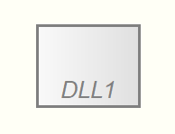
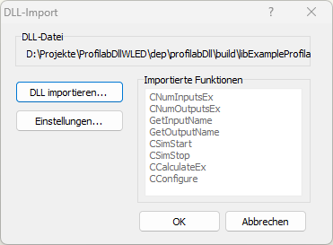

# ProfiLabDll

This library provides C++ bindings for Profilab. For event handling [EBCpp](https://github.com/Tropby/EBCpp) is used. The reulting DLL file can be used in Profilab and perform some special actions.



## DLL Functions

The following C functions are exported to Profilab:

* CNumInputsEx
* CNumOutputsEx
* GetInputName
* GetOutputName
* CSimStart
* CSimStop
* CCalculateEx
* CConfigure



## Disclaimer

The Software _ProfiLab-Expert 4.0_ is published and sold by Abacom. I do not have anything to do with this company. All brand names, trademarks and product images used here are the property of their respective owners and are used for descriptive purposes only.

## Compiler

Using [WinLibs](https://winlibs.com/) GCC compiler for windows (Win32). Otherwise the exported functions may not be named the right way.

### Tested with this compiler

[GCC 14.2.0 (with POSIX threads) + LLVM/Clang/LLD/LLDB 19.1.1 + MinGW-w64 12.0.0 UCRT - release 2](
https://github.com/brechtsanders/winlibs_mingw/releases/download/14.2.0posix-19.1.1-12.0.0-ucrt-r2/winlibs-i686-posix-dwarf-gcc-14.2.0-llvm-19.1.1-mingw-w64ucrt-12.0.0-r2.zip)

## Example

This example will create an useless DLL. The output is always following the input.

```C++
#define DLL_CLASS Example
#include <profilab.hpp>
```

First of all we need to define the name of the DLL class. This definition is used by the Profilab header files to communicate with this class.
After this the `profilab.hpp` file must be included.

```C++
class DLL_CLASS : public Profilab
{
public:
    Example()
    {
    }

    virtual void init()
    {
        addInput("IN1");
        addOutput("OUT1");
    };

    virtual void start()
    {

    };

    virtual void update()
    {
        getOutput(0)->setValue(getInput(0)->getValue());
    };

    virtual void stop()
    {

    };

    virtual void configure()
    {

    };
};
```

Followed by the implementation of the profilab DLL. This will add an input "IN1" and an output "OUT1" to the DLL. While simulating the output will follow the input value.
Allways the class name should be `DLL_CLASS` as defined before.

* init => is called if the DLL is added to the project. Therefore this is the best place to define the inputs and outputs.
* start => is called if the simulation is started
* update => is called for every simulation step profilab is doing.
* stop => is called if the simulation is stoped
* configure => is called if you click on configure in profilab.

```C++
#include <profilabDll.hpp>
```

It is very important that the `profilabDll.hpp` is included at the end of the file. Otherwise the DLL export functions are not working.

### CMake file

```CMAKE
cmake_minimum_required(VERSION 3.10.0)
project(ProfiLabDllTest VERSION 0.1.0)

include (dep/profilabDll/profilabDll.cmake)

add_library(ProfiLabDllTest SHARED src/profiLabDllWLED.cpp)

target_link_libraries(ProfiLabDllTest ${EBCPP_LIBS} -lWs2_32)

target_compile_definitions(ProfiLabDllTest PRIVATE WIN_EXPORT)
```
